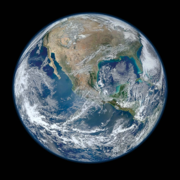

# :earth_africa: Location
###### t
A place in the Universe. A location can be of a `type`.

Use the templates [Location](../Templates/Location%20-TEMPLATE-.md) and [Location type](../Templates/Location%20type%20-TEMPLATE-.md).
***
 

## Location types
<!-- note-overview-plugin
search: tag:location.type
fields: title
alias: title AS Type
sort: title ASC
details:
  open: true
  summary: Types - {{count}}
-->

Types - 1

| Type |
| --- |
|[Planet](../1.Mind/Planet.md)|

<!--endoverview-->

[⬆️](#t)
***
 

  
## All Locations
<!-- note-overview-plugin
search: tag:location
fields: title, image
alias: title AS Location, image AS Pic
sort: title ASC
details:
  open: true
  summary: Location - {{count}}
-->

Location - 1

| Location | Pic |
| --- | --- |
|[Earth](../1.Mind/Earth.md)||

<!--endoverview-->

[⬆️](#t)
***
 

| Tagging |
|-|
| `location` `location.type.*` |
[⬆️](#t)
***
 