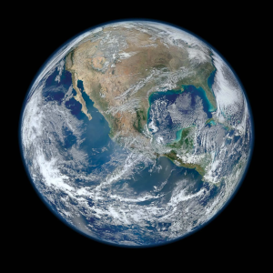

# Earth 
###### t

Our beautiful [planet](../1.Mind/Planet.md). Third rock from the Sun. Home.

| | |
|---|---|
| Containing locations :| `Tag locations that this location is in` |
| Location type(s) :| [Planet](../1.Mind/Planet.md) |
[⬆️](#t)
***
 

<!-- note-overview-plugin
search: tag:location tag:l.earth
fields: title
alias: title AS Location
sort: title ASC
details:
  open: false
  summary: Locations inside this location - {{count}}
-->

Locations inside this location - 0

| Location |
| --- |

<!--endoverview-->

<!-- note-overview-plugin
search: tag:person tag:l.earth
fields: title
alias: title AS Person
sort: title ASC
details:
  open: false
  summary: Persons connected - {{count}}
-->

Persons connected - 0

| Person |
| --- |

<!--endoverview-->

<!-- note-overview-plugin
search: tag:organization tag:l.earth
fields: title
alias: title AS Organization
sort: title ASC
details:
  open: false
  summary: Organizations - {{count}}
-->

Organizations - 0

| Organization |
| --- |

<!--endoverview-->

<!-- note-overview-plugin
search: type:note -tag:person -tag:organization -tag:location -tag:media tag:l.earth
fields: title
alias: title AS Note
sort: title ASC
details:
  open: false
  summary: Notes - {{count}}
-->

Notes - 0

| Note |
| --- |

<!--endoverview-->

<!-- note-overview-plugin
search: tag:media tag:l.earth
fields: title
alias: title AS Media
sort: title ASC
details:
  open: false
  summary: Media - {{count}}
-->

Media - 0

| Media |
| --- |

<!--endoverview-->

[⬆️](#t)
***
 

| LinkTags | Tagging |
|-|-|
| [Location](../1.Mind/Location.md) | `l.earth` |
[⬆️](#t)
***
 